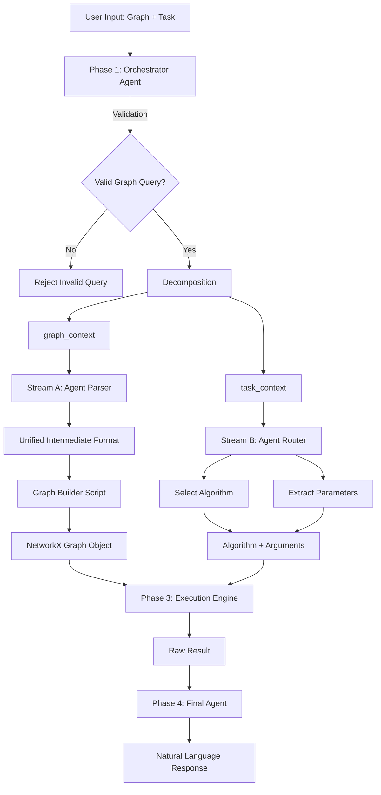
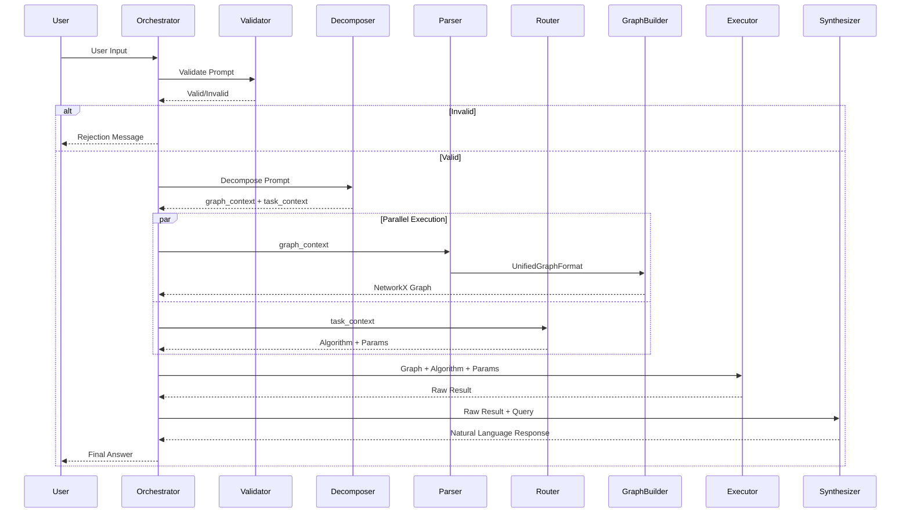

# Implementation Changes Required for Updated Pipeline

## Executive Summary

This document outlines all necessary changes to implement the 4-phase pipeline architecture for the LLM Graph Reasoning Framework.

---

## 🎯 Pipeline Architecture Overview



---

## 📊 Current Implementation Status

| Component | Status | Location |
|-----------|--------|----------|
| Agent Parser (Stream A) | ✅ Implemented | `src/agents/parser.py` |
| Agent Router/Chooser (Stream B) | ✅ Implemented | `src/agents/chooser.py` |
| Execution Engine | ✅ Implemented | `src/algorithms/executor.py` |
| Graph Algorithms | ✅ Implemented | `src/algorithms/*` |
| **Orchestrator Agent** | ❌ Missing | - |
| **Graph Builder** | ⚠️ Partial | `src/utils/graph_utils.py` (stubs only) |
| **Unified Format** | ❌ Not Defined | - |
| **Final Agent (Synthesizer)** | ❌ Missing | - |
| **Verifier** | ⚠️ Exists but not integrated | `src/agents/verifier.py` |

---

## 🔧 Priority 1: Core Pipeline Components (Must Have)

### 1. Create Orchestrator Module

#### 📁 New Files

**File: `code/src/orchestrator/__init__.py`**
```python
"""
Orchestrator module for the LLM Graph Reasoning Framework
"""

from .orchestrator import AgentOrchestrator
from .validator import PromptValidator
from .decomposer import PromptDecomposer

__all__ = ["AgentOrchestrator", "PromptValidator", "PromptDecomposer"]
```

**File: `code/src/orchestrator/orchestrator.py`**

**Purpose**: Main orchestrator that coordinates the entire pipeline

**Required functionality**:
- Accept raw user input
- Validate the prompt is a graph-related query
- Decompose into graph_context and task_context
- Coordinate parallel execution of Stream A (Parser) and Stream B (Router)
- Pass results to Executor
- Pass raw results to Synthesizer
- Return final natural language response

**Key methods**:
```python
class AgentOrchestrator:
    def __init__(self, llm_client, parser, chooser, executor, synthesizer, validator=None):
        """Initialize orchestrator with all pipeline components"""
        
    def execute(self, user_input: str) -> PipelineResult:
        """
        Execute the full pipeline on user input.
        
        Returns:
            PipelineResult with solution, success flag, metadata
        """
        
    def _validate_prompt(self, prompt: str) -> ValidationResult:
        """Validate that prompt is a graph reasoning task"""
        
    def _decompose_prompt(self, prompt: str) -> Tuple[str, str]:
        """
        Split prompt into (graph_context, task_context)
        
        Returns:
            Tuple[str, str]: (graph_context, task_context)
        """
        
    def _execute_parallel_streams(self, graph_ctx: str, task_ctx: str):
        """Execute Stream A and Stream B in parallel"""
```

**Dependencies**:
- `agents.parser.AgentParser`
- `agents.chooser.AgentChooser`
- `algorithms.executor.AlgorithmExecutor`
- `agents.synthesizer.AgentSynthesizer` (new)
- `models.base.BaseLLMClient`

---

**File: `code/src/orchestrator/validator.py`**

**Purpose**: Validate that user prompts are graph-related queries

**Required functionality**:
```python
class ValidationResult(BaseModel):
    is_valid: bool
    rejection_reason: Optional[str] = None
    confidence: float

class PromptValidator:
    def __init__(self, llm_client):
        """Initialize validator with LLM client"""
        
    def validate(self, prompt: str) -> ValidationResult:
        """
        Check if prompt contains a graph reasoning task.
        
        Examples of INVALID prompts:
        - "What is the capital of France?"
        - "Solve 2 + 2"
        - "Write me a poem"
        
        Examples of VALID prompts:
        - "Graph: A--B--C. Is A connected to C?"
        - "Find shortest path from X to Y in graph..."
        """
        
    def _check_graph_keywords(self, prompt: str) -> bool:
        """Check for graph-related keywords (nodes, edges, path, etc.)"""
        
    def _llm_validation(self, prompt: str) -> ValidationResult:
        """Use LLM to validate prompt semantically"""
```

---

**File: `code/src/orchestrator/decomposer.py`**

**Purpose**: Split user input into `graph_context` and `task_context`

**Required functionality**:
```python
class DecompositionResult(BaseModel):
    graph_context: str
    task_context: str
    confidence: float

class PromptDecomposer:
    def __init__(self, llm_client):
        """Initialize decomposer with LLM client"""
        
    def decompose(self, prompt: str) -> DecompositionResult:
        """
        Split prompt into two distinct chunks.
        
        Example:
            Input: "Graph: A--B, B--C. Task: Is A connected to C?"
            Output:
                graph_context = "Graph: A--B, B--C"
                task_context = "Is A connected to C?"
        """
        
    def _extract_graph_description(self, prompt: str) -> str:
        """Extract the graph structure description"""
        
    def _extract_task_query(self, prompt: str) -> str:
        """Extract the task/query portion"""
```

---

### 2. Create Synthesizer Agent (Final Agent)

#### 📁 New File

**File: `code/src/agents/synthesizer.py`**

**Purpose**: Convert raw algorithm results into natural language responses

**Required functionality**:
```python
class SynthesisResult(BaseModel):
    natural_language_response: str
    raw_result: Any
    metadata: Optional[Dict[str, Any]] = None

class AgentSynthesizer:
    def __init__(self, llm_client):
        """Initialize synthesizer with LLM client"""
        
    def synthesize(
        self, 
        raw_result: Any, 
        task_query: str,
        algorithm_name: str,
        graph_structure: Optional[Any] = None
    ) -> SynthesisResult:
        """
        Convert raw algorithm output to natural language.
        
        Examples:
            Input: raw_result=4, task_query="Find shortest path A to D"
            Output: "The shortest path from A to D has length 4."
            
            Input: raw_result=True, task_query="Is A connected to C?"
            Output: "Yes, node A is connected to node C."
            
            Input: raw_result=[A, B, C], task_query="Find path from A to C"
            Output: "The path from A to C is: A → B → C"
        """
        
    def _format_path_result(self, path: List[str]) -> str:
        """Format path lists into readable strings"""
        
    def _format_numeric_result(self, value: float, task_type: str) -> str:
        """Format numeric results based on task type"""
        
    def _format_boolean_result(self, value: bool, task_query: str) -> str:
        """Format yes/no results"""
```

#### 📝 Modify Existing File

**File: `code/src/agents/prompts.py`**

**Add synthesizer prompts**:
```python
class SynthesizerPrompts:
    """LLM prompts for result synthesis."""
    
    SYNTHESIS_TEMPLATE = """
You are a helpful assistant that explains graph algorithm results in natural language.

Original Query: {task_query}
Algorithm Used: {algorithm_name}
Raw Result: {raw_result}

Provide a clear, concise natural language answer to the user's query based on the algorithm result.

Response:"""

    @staticmethod
    def format_synthesis_prompt(
        task_query: str,
        algorithm_name: str,
        raw_result: Any
    ) -> str:
        """Format synthesis prompt"""
        return SynthesizerPrompts.SYNTHESIS_TEMPLATE.format(
            task_query=task_query,
            algorithm_name=algorithm_name,
            raw_result=str(raw_result)
        )
```

#### 📝 Update agents `__init__.py`

**File: `code/src/agents/__init__.py`**

**Changes**:
```python
"""
Agent implementations for graph reasoning pipeline
"""

from .parser import AgentParser
from .chooser import AgentChooser
from .verifier import AgentVerifier
from .synthesizer import AgentSynthesizer  # NEW

__all__ = ["AgentParser", "AgentChooser", "AgentVerifier", "AgentSynthesizer"]  # UPDATED
```

---

### 3. Implement Graph Builder (Unified Format → NetworkX)

#### 📝 Modify Existing File

**File: `code/src/utils/graph_utils.py`**

**Implement these methods** (currently all raise `NotImplementedError`):

```python
@staticmethod
def dict_to_networkx(graph_dict: Dict[str, Any]) -> nx.Graph:
    """
    Convert dictionary representation to NetworkX graph.
    
    Expected input format (Unified Intermediate Format):
    {
        "nodes": ["A", "B", "C"],
        "edges": [["A", "B"], ["B", "C"]],
        "directed": false,
        "weighted": false,
        "weights": {}  # Optional: {"A-B": 1.5, "B-C": 2.0}
    }
    
    Returns:
        NetworkX Graph or DiGraph object
    """
    # Implementation required:
    # 1. Choose Graph or DiGraph based on "directed" flag
    # 2. Add all nodes
    # 3. Add all edges
    # 4. Add weights if "weighted" is True
    # 5. Validate structure
```

```python
@staticmethod
def networkx_to_dict(graph: nx.Graph) -> Dict[str, Any]:
    """
    Convert NetworkX graph to dictionary.
    
    Returns unified intermediate format for serialization.
    """
    # Implementation required:
    # 1. Extract nodes as list
    # 2. Extract edges as list of tuples/lists
    # 3. Determine if directed
    # 4. Extract weights if present
    # 5. Return standardized dict
```

```python
@staticmethod
def validate_graph(graph: nx.Graph) -> bool:
    """
    Validate graph structure.
    
    Checks:
    - No self-loops (unless explicitly allowed)
    - All edges reference valid nodes
    - Weights are valid numbers (if weighted)
    - No isolated nodes (warning, not error)
    """
    # Implementation required
```

---

### 4. Define Unified Intermediate Format

#### 📁 New File (Optional but Recommended)

**File: `code/src/models/graph_format.py`**

**Purpose**: Formal specification of the intermediate format between Parser → Graph Builder

```python
from typing import List, Dict, Optional, Union
from pydantic import BaseModel, Field, validator

class UnifiedGraphFormat(BaseModel):
    """
    Standardized graph representation format.
    
    This is the contract between Agent Parser and Graph Builder.
    """
    nodes: List[str] = Field(..., description="List of node identifiers")
    edges: List[List[str]] = Field(..., description="List of edges as [source, target] pairs")
    directed: bool = Field(default=False, description="Whether graph is directed")
    weighted: bool = Field(default=False, description="Whether graph has edge weights")
    weights: Optional[Dict[str, float]] = Field(default=None, description="Edge weights as 'A-B': weight")
    metadata: Optional[Dict[str, Any]] = Field(default=None, description="Additional graph properties")
    
    @validator('edges')
    def validate_edges(cls, v, values):
        """Ensure all edges are pairs"""
        for edge in v:
            if len(edge) != 2:
                raise ValueError(f"Edge must be a pair, got: {edge}")
        return v
    
    @validator('weights')
    def validate_weights(cls, v, values):
        """Ensure weights match edges if weighted"""
        if values.get('weighted') and not v:
            raise ValueError("Graph marked as weighted but no weights provided")
        return v
    
    def to_dict(self) -> Dict[str, Any]:
        """Convert to plain dictionary for Graph Builder"""
        return self.dict(exclude_none=True)
    
    @classmethod
    def from_graph_structure(cls, graph_structure) -> 'UnifiedGraphFormat':
        """Convert from AgentParser's GraphStructure to UnifiedGraphFormat"""
        # Conversion logic here
        pass
```

---

### 5. Create Main Pipeline Entry Point

#### 📁 New File

**File: `code/src/pipeline.py`**

**Purpose**: Main entry point that wires the entire pipeline together

```python
"""
Main pipeline entry point for the LLM Graph Reasoning Framework
"""

from typing import Optional
from pydantic import BaseModel

from agents import AgentParser, AgentChooser, AgentSynthesizer, AgentVerifier
from algorithms import AlgorithmExecutor
from orchestrator import AgentOrchestrator, PromptValidator, PromptDecomposer
from models import BaseLLMClient
from utils.graph_utils import GraphUtils


class PipelineResult(BaseModel):
    """Result from the complete pipeline execution"""
    success: bool
    natural_language_response: str
    raw_result: Optional[Any] = None
    graph_structure: Optional[Any] = None
    algorithm_used: Optional[str] = None
    error_message: Optional[str] = None
    metadata: Optional[Dict[str, Any]] = None


class GraphReasoningPipeline:
    """
    Complete graph reasoning pipeline.
    
    Usage:
        >>> from models import OllamaClient
        >>> llm = OllamaClient(model_name="llama3.1:8b-instruct")
        >>> pipeline = GraphReasoningPipeline(llm)
        >>> result = pipeline.run("Graph: A--B--C. Is A connected to C?")
        >>> print(result.natural_language_response)
    """
    
    def __init__(self, llm_client: BaseLLMClient, enable_verification: bool = False):
        """
        Initialize the complete pipeline.
        
        Args:
            llm_client: LLM client for all agents
            enable_verification: Whether to enable verification loop
        """
        # Initialize all components
        self.parser = AgentParser(llm_client)
        self.chooser = AgentChooser(llm_client)
        self.executor = AlgorithmExecutor()
        self.synthesizer = AgentSynthesizer(llm_client)
        self.validator = PromptValidator(llm_client)
        self.decomposer = PromptDecomposer(llm_client)
        
        if enable_verification:
            self.verifier = AgentVerifier(llm_client)
        else:
            self.verifier = None
        
        # Initialize orchestrator
        self.orchestrator = AgentOrchestrator(
            llm_client=llm_client,
            parser=self.parser,
            chooser=self.chooser,
            executor=self.executor,
            synthesizer=self.synthesizer,
            validator=self.validator,
            decomposer=self.decomposer,
            verifier=self.verifier
        )
    
    def run(self, user_input: str) -> PipelineResult:
        """
        Execute the full 4-phase pipeline.
        
        Args:
            user_input: Natural language input containing graph and task
            
        Returns:
            PipelineResult with natural language response
        """
        return self.orchestrator.execute(user_input)
```

---

## 🔄 Priority 2: Integration & Workflow

### 6. Implement Parallel Execution

**File: `code/src/orchestrator/orchestrator.py`**

**Add parallel processing support**:

**Option A: Sequential (Simplest)**
```python
def _execute_parallel_streams(self, graph_ctx: str, task_ctx: str):
    """Execute streams sequentially (no parallelism)"""
    # Stream A: Parse graph
    graph_structure = self.parser.parse(graph_ctx)
    
    # Stream B: Choose algorithm
    algorithm_choice = self.chooser.choose_algorithm(task_ctx, graph_structure)
    
    return graph_structure, algorithm_choice
```

**Option B: Async (Recommended)**
```python
import asyncio

async def _execute_parallel_streams_async(self, graph_ctx: str, task_ctx: str):
    """Execute Stream A and Stream B in parallel using asyncio"""
    # Start both streams concurrently
    stream_a = asyncio.create_task(self._run_stream_a(graph_ctx))
    stream_b = asyncio.create_task(self._run_stream_b(task_ctx))
    
    # Wait for both to complete
    graph_structure, algorithm_choice = await asyncio.gather(stream_a, stream_b)
    
    return graph_structure, algorithm_choice

async def _run_stream_a(self, graph_ctx: str):
    """Stream A: Data Pipeline"""
    return self.parser.parse(graph_ctx)

async def _run_stream_b(self, task_ctx: str):
    """Stream B: Logic Pipeline"""
    return self.chooser.choose_algorithm(task_ctx)
```

**Option C: Threading**
```python
from concurrent.futures import ThreadPoolExecutor
import concurrent.futures

def _execute_parallel_streams(self, graph_ctx: str, task_ctx: str):
    """Execute Stream A and Stream B in parallel using threads"""
    with ThreadPoolExecutor(max_workers=2) as executor:
        future_a = executor.submit(self.parser.parse, graph_ctx)
        future_b = executor.submit(self.chooser.choose_algorithm, task_ctx)
        
        graph_structure = future_a.result()
        algorithm_choice = future_b.result()
    
    return graph_structure, algorithm_choice
```

---

### 7. Update Examples

#### 📝 Modify Existing File

**File: `code/examples/basic_usage.py`**

**Uncomment and update the example code**:

```python
from src.pipeline import GraphReasoningPipeline
from src.models import OllamaClient

def example_basic_usage():
    """Basic example of using the framework."""
    print("Basic Usage Example")
    print("=" * 60)
    
    # Initialize LLM client
    llm_client = OllamaClient(model_name="llama3.1:8b-instruct")
    
    # Initialize pipeline
    pipeline = GraphReasoningPipeline(llm_client)
    
    # Run a query
    query = "Graph: Nodes A, B, C, D with edges A--B, B--C, C--D. Task: Is A connected to D?"
    
    result = pipeline.run(query)
    
    print(f"Query: {query}")
    print(f"Response: {result.natural_language_response}")
    print(f"Success: {result.success}")
    print(f"Algorithm Used: {result.algorithm_used}")
```

---

## 🎨 Priority 3: Enhancements (Optional)

### 8. Implement AgentVerifier Methods

**File: `code/src/agents/verifier.py`**

**Implement all methods that currently raise `NotImplementedError`**:

- `verify_structure()`
- `verify_solution()`
- `_verify_connectivity()`
- `_verify_shortest_path()`
- `_verify_flow()`
- `generate_repair_feedback()`

This enables an actor-critic loop for error correction.

---

### 9. Enhanced Algorithm Registry

**File: `code/src/algorithms/executor.py`**

**Add more detailed metadata**:

```python
def _register_all_algorithms(self):
    """Register algorithms with enhanced metadata"""
    
    self.register_algorithm(
        name="bfs_shortest_path",
        implementation=ShortestPathAlgorithms.bfs_shortest_path,
        metadata={
            "complexity": "O(V + E)",
            "preconditions": ["connected_graph"],
            "task_types": ["shortest_path", "connectivity"],
            "graph_types": ["unweighted", "directed", "undirected"],
            "description": "BFS-based shortest path for unweighted graphs",
            "parameters": ["source", "target"]
        }
    )
```

This allows the Router to make smarter algorithm selections.

---

### 10. Add Comprehensive Logging

**New File: `code/src/utils/pipeline_logger.py`**

```python
import logging
from typing import Optional

class PipelineLogger:
    """Structured logging for pipeline execution"""
    
    def __init__(self, log_level: str = "INFO"):
        self.logger = logging.getLogger("GraphReasoningPipeline")
        # Configure structured logging
        
    def log_phase_start(self, phase: str, context: dict):
        """Log the start of a pipeline phase"""
        
    def log_phase_end(self, phase: str, result: dict):
        """Log the end of a pipeline phase"""
        
    def log_error(self, phase: str, error: Exception):
        """Log pipeline errors"""
```

---

## 📋 Implementation Checklist

### Phase 1: Orchestrator (Week 1)
- [ ] Create `src/orchestrator/` folder
- [ ] Implement `PromptValidator` class
- [ ] Implement `PromptDecomposer` class
- [ ] Implement `AgentOrchestrator` class
- [ ] Add validation prompts
- [ ] Add decomposition prompts
- [ ] Write unit tests for validator
- [ ] Write unit tests for decomposer

### Phase 2: Synthesizer (Week 1-2)
- [ ] Create `AgentSynthesizer` class
- [ ] Add synthesis prompts to `prompts.py`
- [ ] Implement result formatting methods
- [ ] Handle different result types (bool, int, list, dict)
- [ ] Update `agents/__init__.py`
- [ ] Write unit tests for synthesizer

### Phase 3: Graph Builder (Week 2)
- [ ] Define `UnifiedGraphFormat` spec
- [ ] Implement `GraphUtils.dict_to_networkx()`
- [ ] Implement `GraphUtils.networkx_to_dict()`
- [ ] Implement `GraphUtils.validate_graph()`
- [ ] Update `AgentParser` to output `UnifiedGraphFormat`
- [ ] Write unit tests for graph conversion

### Phase 4: Pipeline Integration (Week 2-3)
- [ ] Create `pipeline.py` with `GraphReasoningPipeline` class
- [ ] Wire all components together in orchestrator
- [ ] Implement parallel execution (choose option)
- [ ] Add error handling throughout pipeline
- [ ] Update `examples/basic_usage.py`
- [ ] Create end-to-end integration tests

### Phase 5: Refinement (Week 3-4)
- [ ] Implement `AgentVerifier` methods (optional)
- [ ] Add comprehensive logging
- [ ] Add performance metrics tracking
- [ ] Optimize parallel execution
- [ ] Create documentation
- [ ] Run benchmark evaluations

---

## 🚀 Quick Start Guide (After Implementation)

**1. Install dependencies**
```bash
cd code
pip install -r requirements.txt
```

**2. Set up environment**
```bash
cp .env.example .env
# Edit .env with your API keys
```

**3. Run basic example**
```bash
python examples/basic_usage.py
```

**4. Using the pipeline programmatically**
```python
from src.pipeline import GraphReasoningPipeline
from src.models import OllamaClient

# Initialize
llm = OllamaClient(model_name="llama3.1:8b-instruct")
pipeline = GraphReasoningPipeline(llm)

# Run query
result = pipeline.run("Graph: A--B, B--C. Find shortest path from A to C.")
print(result.natural_language_response)
```

---

## 📐 Architectural Diagrams

### Data Flow Diagram



---

## 🔍 Key Design Decisions

### 1. Unified Intermediate Format
**Decision**: Use Pydantic `UnifiedGraphFormat` model

**Rationale**:
- Type safety via Pydantic validation
- Clear contract between Parser and Graph Builder
- Easy serialization/deserialization
- Self-documenting

### 2. Parallel Execution Strategy
**Recommendation**: Use `asyncio` (Option B)

**Rationale**:
- Non-blocking I/O for LLM calls
- Better performance than threading for I/O-bound tasks
- Modern Python best practice
- Easy to add timeout handling

### 3. Verifier Integration
**Decision**: Make optional (disabled by default)

**Rationale**:
- Adds latency to pipeline
- Only needed for high-stakes applications
- Can be enabled via flag
- Implementation can be deferred to Phase 5

---

## 📚 Additional Resources

### Related Files to Review
- Current parser implementation: [parser.py](file:///c:/Users/user/OneDrive%20-%20post.bgu.ac.il/Courses-Drive/sem7/Research%20Methods/LLM-understand-graph/code/src/agents/parser.py)
- Current chooser implementation: [chooser.py](file:///c:/Users/user/OneDrive%20-%20post.bgu.ac.il/Courses-Drive/sem7/Research%20Methods/LLM-understand-graph/code/src/agents/chooser.py)
- Algorithm executor: [executor.py](file:///c:/Users/user/OneDrive%20-%20post.bgu.ac.il/Courses-Drive/sem7/Research%20Methods/LLM-understand-graph/code/src/algorithms/executor.py)
- Graph utilities: [graph_utils.py](file:///c:/Users/user/OneDrive%20-%20post.bgu.ac.il/Courses-Drive/sem7/Research%20Methods/LLM-understand-graph/code/src/utils/graph_utils.py)

### Testing Strategy
1. **Unit Tests**: Each component in isolation
2. **Integration Tests**: Full pipeline end-to-end
3. **Benchmark Tests**: Using NLGraph dataset
4. **Performance Tests**: Latency and throughput

---

## ✅ Definition of Done

The implementation is complete when:

1. ✅ All Priority 1 components are implemented
2. ✅ Full pipeline runs end-to-end without errors
3. ✅ `examples/basic_usage.py` executes successfully
4. ✅ Unit tests pass for all new components
5. ✅ At least one integration test passes
6. ✅ Documentation is updated
7. ✅ Code review is complete

---

## 📞 Next Steps

1. **Review this document** and identify any missing requirements
2. **Prioritize components** based on your team's capacity
3. **Assign tasks** to team members
4. **Set up development branches** for each major component
5. **Begin implementation** starting with the Orchestrator module

---

*Last Updated: 2026-01-12*
